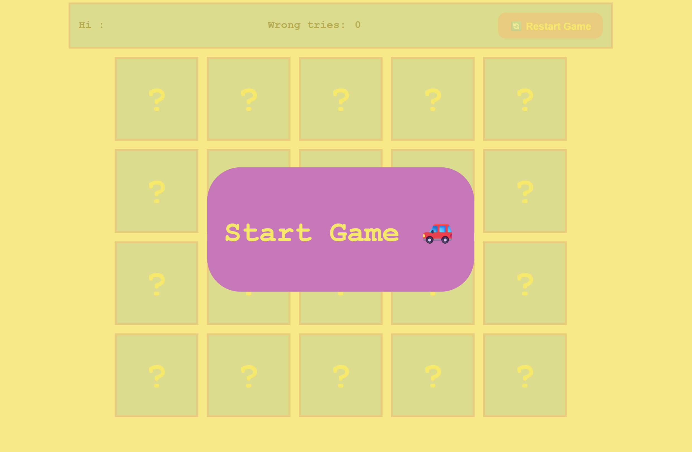
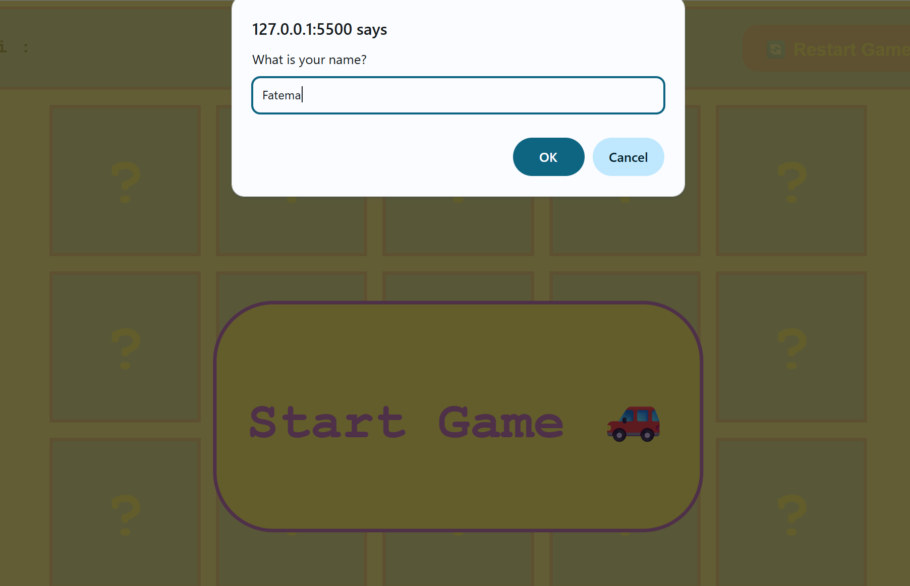
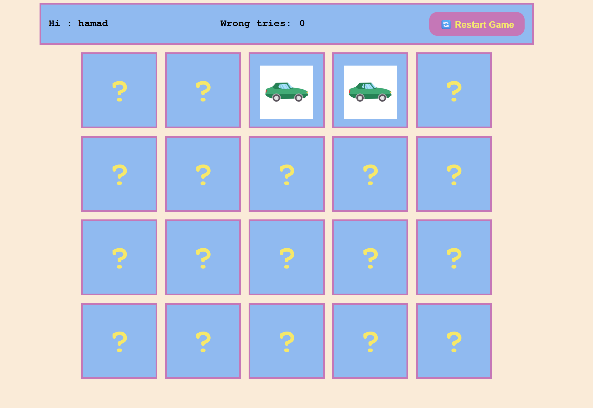
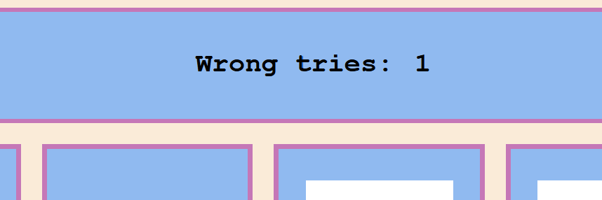
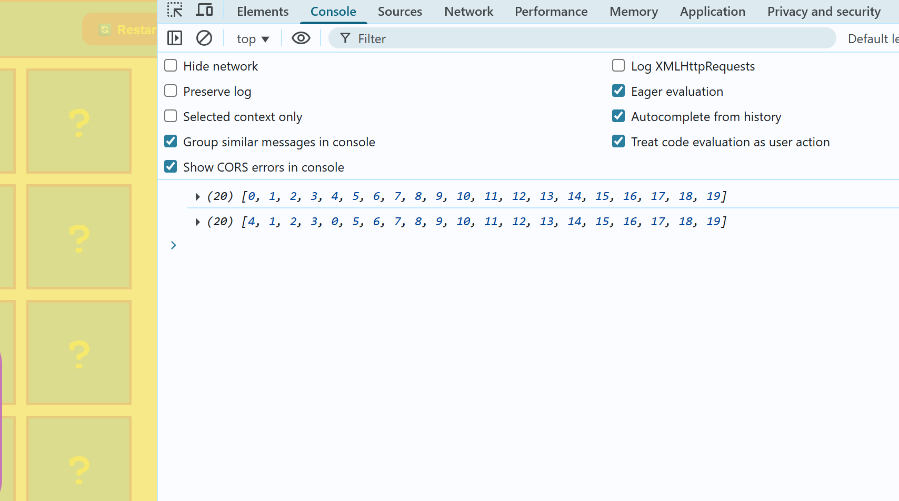
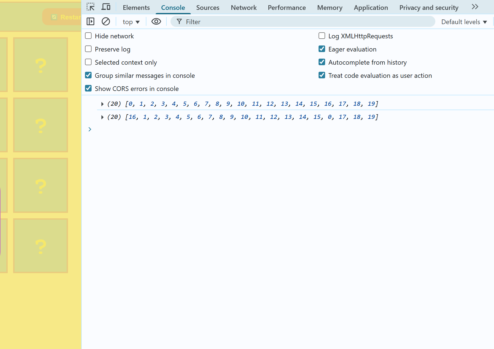
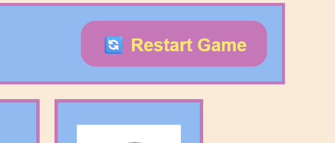

 # Memory Card Game

 A simple and interactive memory card game built using HTML, CSS, and JavaScript. The objective is to match all pairs of cards with the same image in the least amount of time and moves possible.

 ## Features
 * ***Interactive Gameplay:*** Click on cards to reveal their images and find matching pairs.


* ***Try Counter:*** Counts the number of wrong attempts.

* It helps to strengthen players' concentration.

## How to Play
1. Click on any card to reveal its image.

 2. Click on another card to find its matching pair.

 3. If the cards match, they remain face-up; otherwise, they flip back after a short delay.
 
 4. Continue until all pairs are matched.

 5. The game concludes when all pairs are successfully matched.

 ## Technologies Used
 * ***HTML :***  Structure of the game.


 * ***CSS :*** Styling and layout
 * ***JavaScript :*** Game logic and interactivity.


### Here are some details about the implementation of the game
**First page**



   *In the first page players have to press start then enter there name*

   

  *here the code*
 ``` 
const startGame = document.querySelector(".firstPage-button >span");


startGame.onclick = function() {
  let yourName = prompt('What is your name?');
  console.log(yourName);

  if (yourName ==''|| yourName == null){
    document.querySelector('.name span').innerHTML='unknown';
  }else {
     document.querySelector('.name span').innerHTML=yourName;
  }
// remove the first page in both with nme or whithowt
   document.querySelector('.firstPage-button').remove()

};
```


*then the game will Start by Click on any card to reveal its image try and find its matching pair.*




*A counter keeps track of the number of wrong try made by the player*




*I used random features to distribute images randomly in the array.*






*Also there is restart button that will start from the biggining*



***And hera the whole code for the game*** 
***HTML***


I hope you enjoy playing.

[resorce](https://help-author.iseazy.com/hc/en-us/articles/19453389894034-Memory-Game?utm_source=chatgpt.com)
[sounds](https://mixkit.co/free-sound-effects/game/)