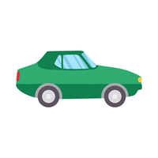
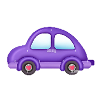
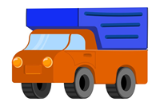
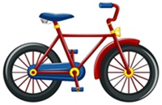
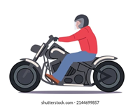

 # Memory Card Game

 A simple and interactive memory card game built using HTML, CSS, and JavaScript. The objective is to match all pairs of cards with the same image in the least amount of time and moves possible.

 ## Features
 * ***Interactive Gameplay:*** Click on cards to reveal their images and find matching pairs.


* ***Try Counter:*** Counts the number of wrong attempts.

* It helps to strengthen players' concentration.

## How to Play
1. Click on any card to reveal its image.

 2. Click on another card to find its matching pair.

 3. If the cards match, they remain face-up; otherwise, they flip back after a short delay.
 
 4. Continue until all pairs are matched.

 5. The game concludes when all pairs are successfully matched.

[Live Demo](https://fatemaalalaiwi.github.io/Memory-cards-Game/)

 ## Technologies Used
 * ***HTML :***  Structure of the game.


 * ***CSS :*** Styling and layout
 * ***JavaScript :*** Game logic and interactivity.


### Here are some details about the implementation of the game
**First page**


   *In the first page players have to press start then enter there name*

   

  *here the code*
 ``` 
const startGame = document.querySelector(".firstPage-button >span");


startGame.onclick = function() {
  let yourName = prompt('What is your name?');
  console.log(yourName);

  if (yourName ==''|| yourName == null){
    document.querySelector('.name span').innerHTML='unknown';
  }else {
     document.querySelector('.name span').innerHTML=yourName;
  }
// remove the first page in both with nme or whithowt
   document.querySelector('.firstPage-button').remove()

};
```


*then the game will Start by Click on any card to reveal its image try and find its matching pair.*


*A counter keeps track of the number of wrong try made by the player*


*I used random features to distribute images randomly in the array.*


*Also there is restart button that will start from the biggining*


***And hera the whole code for the game*** 

***HTML***

```<!DOCTYPE html>
<html lang="en">
<head>
    <meta charset="UTF-8">
    <meta name="viewport" content="width=device-width, initial-scale=1.0">
    <title>Project 1</title>
 <script defer src="app.js"></script>
 <link rel="stylesheet" href="style.css">


</head>
<body>
    <div class="firstPage-button">
        <span>Start Game 🚗</span>
    </div>

    <div class="header-contener">
        <div class="name"> Hi : <span></span>
        </div>
         <div><button class ="restart-button">🔄 Restart Game</button></div>
        <div class="tries"> 
            Wrong tries: <span>0</span>
        </div>
    </div>

    <div class="memory-game-blocks">
       <!-- front and back imge -->
        <!-- 1 -->
<div class="game-block" data-technology="car-blue">
    <div class="face front"></div>
    <div class="face back">
        
    </div> 
</div>

<div class="game-block"  data-technology="car-blue">
    <div class="face front"></div>
    <div class="face back">
        
    </div> 
</div>
 <!-- 2 -->
<div class="game-block" data-technology="car-green">
    <div class="face front"></div>
    <div class="face back">
        
    </div> 
</div>

<div class="game-block"  data-technology="car-green">
    <div class="face front"></div>
    <div class="face back">
        
    </div> 
</div>

 <!-- 3 -->
<div class="game-block" data-technology="car-orang">
    <div class="face front"></div>
    <div class="face back">
        
    </div> 
</div>

<div class="game-block"  data-technology="car-orang">
    <div class="face front"></div>
    <div class="face back">
        
    </div> 
</div>
  <!-- 4 -->
<div class="game-block" data-technology="car-purple">
    <div class="face front"></div>
    <div class="face back">
        
    </div> 
</div>

<div class="game-block"  data-technology="car-purple">
    <div class="face front"></div>
    <div class="face back">
        
    </div> 
</div>
   <!-- 5 -->
<div class="game-block" data-technology="car-red">
    <div class="face front"></div>
    <div class="face back">
        
    </div> 
</div>

<div class="game-block"  data-technology="car-red">
    <div class="face front"></div>
    <div class="face back">
        
    </div> 
</div>
    <!-- 6 -->
<div class="game-block" data-technology="car-track">
    <div class="face front"></div>
    <div class="face back">
        
    </div> 
</div>

<div class="game-block"  data-technology="car-track">
    <div class="face front"></div>
    <div class="face back">
        
    </div> 
</div>
     <!-- 7 -->
<div class="game-block" data-technology="car-white">
    <div class="face front"></div>
    <div class="face back">
        
    </div> 
</div>

<div class="game-block"  data-technology="car-white">
    <div class="face front"></div>
    <div class="face back">
        
    </div> 
</div>
      <!-- 8 -->
<div class="game-block" data-technology="cycle">
    <div class="face front"></div>
    <div class="face back">
        
    </div> 
</div>

<div class="game-block"  data-technology="cycle">
    <div class="face front"></div>
    <div class="face back">
        
    </div> 
</div>
       <!-- 9 -->
<div class="game-block" data-technology="motor">
    <div class="face front"></div>
    <div class="face back">
        
    </div> 
</div>

<div class="game-block"  data-technology="motor">
    <div class="face front"></div>
    <div class="face back">
        
    </div> 
</div>
        <!-- 10 -->
         <div class="game-block" data-technology="plane">
    <div class="face front"></div>
    <div class="face back">
        
    </div> 
</div>

<div class="game-block"  data-technology="plane">
    <div class="face front"></div>
    <div class="face back">
        
    </div> 
</div>
    </div>
    <audio id="matcing" src="mixkit-winning-a-coin-video-game-2069.wav"></audio>
    <audio id="win" src="mixkit-completion-of-a-level-2063.wav"></audio>
    <audio id="fail" src="mixkit-explainer-video-game-alert-sweep-236.wav"></audio>
<!--  -->
</body>
</html>
 ```
 ***CSS***
 ```


*{
    box-sizing: border-box;
}
body{

    font-family:'Courier New', Courier, monospace;
    background-color: antiquewhite;

}

.firstPage-button{
    position: fixed;
    left :0;
    top: 0;
    width: 100%;
    height: 100%;
    /* 2 coz i wont it on top of pages */
    z-index: 2;
    background-color: #f5e859bd;

}
.firstPage-button span{
    position: absolute;
    left:50%;
    top:50%;
    transform: translate(-50%, -50%);
    background-color:rgb(201, 116, 187); 
    color:#f5e859; 
    padding: 100px 40px;
    font-size: 70px;
    font-weight: bold;
    text-align: center;
    border-radius: 80px;
    /* border-radius: 80%;  for round shape*/
    cursor: pointer;
    

}
.firstPage-button span:hover{

    background-color:#f5e859;
    color:rgb(201, 116, 187) ;
    border: 5px solid rgb(201, 116, 187);
}

.header-contener {
    width: 1300px;
    margin: 0px auto 0;
    background-color: rgb(143, 186, 243);
    padding: 20px;
    font-size: 24px;
    overflow: hidden;
    border: 4px solid rgb(201, 116, 187);
}

.header-contener .name{
    /* display: flex;
    justify-content: start; */
    float: left;
    width: 30%;
    font-weight: bold;
      padding: 15px 0px;
      font-size: 26px;
}


 .restart-button{
  width: 20%;
  background-color: rgb(201, 116, 187) ;
  color: #f5e859;
  padding: 15px 0px;
  font-size: 24px;
  font-weight: bold;
  border: none;
  border-radius: 20px;
  cursor: pointer;
  float: inline-end;
  /* display: flex;
  justify-content: center;  */
  /* transition: background-color 0.3s ease; */

 }
.header-contener .tries{
    display: flex;
    justify-content: center;
    /* float: right; */
    width: 30%;
    /* text-align: right; */
    font-weight: bold;
    gap: 20px;
    padding: 15px 0px;
    font-size: 26px;
}
.memory-game-blocks{
    display: flex;
    width: 1100px;
    flex-wrap: wrap ;
    margin: 20px auto;
    perspective: 1000px; 
   /* to add for 3D effect */

}

.memory-game-blocks .no-clicking{
    pointer-events: none;


}


.memory-game-blocks .game-block{
    height: 200px;
    transition: transform .5s;
    transform-style: preserve-3d;
    cursor: pointer;
    position: relative;
    flex: 1 0 200px;
    margin: 0 10px 20px;
    
}


.memory-game-blocks .game-block .front{
    background-color: rgb(143, 186, 243);
    line-height: 200px;
}

.memory-game-blocks .game-block .front:before{

    content: '?';
    color: #f5e859;
    font-size: 90px;
    font-weight: bold;

}

.memory-game-blocks .game-block .back{
    background-color: rgb(143, 186, 243);
    transform: rotateY(180deg)
}

.memory-game-blocks .game-block .back img {
    width: 140px;
    height: 140px;
    margin-top: 30px;
}

.memory-game-blocks .game-block .face{
    position: absolute;
    width: 100%;
    height: 100%;
    text-align: center;
    backface-visibility: hidden;
    border: 5px solid rgb(201, 116, 187);

}
.memory-game-blocks .game-block.is-flipped ,
.memory-game-blocks .game-block.has-match {
    -webkit-transform: rotateY(180deg);
    -moz-transform: rotateY(180deg);
    transform: rotateY(180deg);
    pointer-events: none;
    

}

 ```

 ***JavaScript***
 ```

const startGame = document.querySelector(".firstPage-button >span");


startGame.onclick = function() {
  let yourName = prompt('What is your name?');
  console.log(yourName);

  if (yourName ==''|| yourName == null){
    document.querySelector('.name span').innerHTML='unknown';
  }else {
     document.querySelector('.name span').innerHTML=yourName;
  }
// remove the first page in both with nme or whithowt
   document.querySelector('.firstPage-button').remove()


};
// 1 step for restart
const restartButton =document.querySelector('.restart-button');

// 3rd step for reset massaga to 0.
const handle  =(event) => {
    // Reset wrong tries count(message)
    document.querySelector('.tries span').textContent = '0';
    // 4th step Flip all cards back and remove match classes
    const cards = document.querySelectorAll('.game-block');
    cards.forEach(card => {
        card.classList.remove('is-flipped', 'has-match');
        
    });} 
// 2 step for restart
restartButton.addEventListener('click', handle);
    // Code to reset the game will go here

// Duration for 1 second
let duration = 1000;

// Select Blocks Container
let blocksContainer = document.querySelector(".memory-game-blocks");

// it will create array for Blocks container by(array.form)
let blocks = Array.from(blocksContainer.children);

// Create Range Of Keys(0-19)
let orderRange = Array.from(Array(blocks.length).keys());

// change the key(id) randomly
 orderRange = shuffle(orderRange);
// console.log(orderRange)


// loop for Game Blocks to make order list by index`
blocks.forEach((block, index) => {
  // Add Order Property
  block.style.order = orderRange[index];
  
  //(B) Add Click Event
  block.addEventListener('click', function () {

    //  if press any block it will flip by using the flip function
    flipBlock(block);

  });

});

//  (A)Flip Block Function for each bloch(animation)
function flipBlock(selectedBlock) {
  // Add Class is-flipped
  selectedBlock.classList.add('is-flipped');

  // Collect All Flipped Cards from blocks array
  let allFlippedBlocks = blocks.filter(flippedBlock => flippedBlock.classList.contains('is-flipped'));

  // If Theres Two Selected Blocks
  if (allFlippedBlocks.length === 2) {
    // now we need 2 Step 1- Clicking Function
    stopClicking();
    // 2-Check Matched Block Function
    checkMatchedBlocks(allFlippedBlocks[0], allFlippedBlocks[1]);

  }

}

// Stop Clicking Function
function stopClicking() {

  // Add Class No Clicking on the Container
  blocksContainer.classList.add('no-clicking');

  // Wait Duration
  setTimeout(() => {

    // Remove Class No Clicking After The Duration of i sec that is 1000
    blocksContainer.classList.remove('no-clicking');

  }, 1000);

}

// Check every 2 block Block
function checkMatchedBlocks(firstBlock, secondBlock) {
 // the numper shown in top titel of tries
  let triesElement = document.querySelector('.tries span');
// if borh blockes is equal
  if (firstBlock.dataset.technology === secondBlock.dataset.technology) {
   //remove is flipped
    firstBlock.classList.remove('is-flipped');
    secondBlock.classList.remove('is-flipped');
   //add has match
    firstBlock.classList.add('has-match');
    secondBlock.classList.add('has-match');

 document.getElementById('matcing').play();


// if diffrent
  } else {
//usinh parsInt coz we need integar
    triesElement.innerHTML = parseInt(triesElement.innerHTML) + 1;

    setTimeout(() => {

      firstBlock.classList.remove('is-flipped');
      secondBlock.classList.remove('is-flipped');
      
    }, duration);

     document.getElementById('fail').play();

  }

}


// Check if all cards have been matched
const matchedCards = document.querySelectorAll('has-match');
if (matchedCards.length === blocks.length) {
  // win actions
  youWin();
}

function youWin() {
   document.getElementById('win').play();
 
}


// Shuffle Function
function shuffle(array) {

  //  Variables
    let currentValue = array.length;
    let  tempValue;
    let random;

  while (currentValue > 0) {

    // Get Random Number
    random = Math.floor(Math.random() * currentValue);
    // Decrease Length of array  By One
    currentValue -= currentValue;
    
    //steps to make random array list element
    // [first] Save Current Element in the temporary value
        tempValue = array[currentValue];

    // [second] save the random element in the current value
        array[currentValue] = array[random];

    // [3] save the temporary value  in the randome place 
        array[random] = tempValue;

  }
  return array;
}

 ```


I hope you enjoy playing.

[resorce](https://help-author.iseazy.com/hc/en-us/articles/19453389894034-Memory-Game?utm_source=chatgpt.com)
[sounds](https://mixkit.co/free-sound-effects/game/)